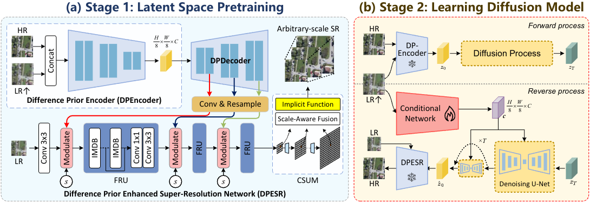

<div align="center">

<h1>Latent Diffusion for Continuous-Scale Super-Resolution of Remote-Sensing Images
</h1>

<div>
    <a href='https://hlwu.ac.cn/' target='_blank'>Hanlin Wu</a><sup>*</sup>&emsp;
    Jiangwei Mo<sup>*</sup>&emsp;
    Xiaohui Sun&emsp;
    Jie Ma
</div>
<div>
    <sup>*</sup> Equal contribution
</div>
<div>
    Beijing Foreign Studies University
</div>

[**Paper**](https://arxiv.org/abs/2410.22830) | [**PDF**](https://arxiv.org/pdf/2410.22830)

---

</div>


## Overview


## Key Highlights
- **Continuous-Scale SR**: Support arbitrary scale factors from 1× to 8× with a single model
- **Two-Stage Latent Diffusion**: Efficient super-resolution in compressed latent space
- **Few-Step Inference**: Only 4 diffusion steps required for high-quality results
- **Remote Sensing Optimized**: Designed specifically for aerial and satellite imagery

## Dependencies and Installation
1. Clone repo
```bash
git clone https://github.com/MoooJianG/LDCSR.git
```
2. Install dependencies
```bash
conda create -n LDCSR python=3.10
conda activate LDCSR
pip install -r requirement.txt
```
## Usage
### Dataset Preparation
We support AID, DOTA, and DIOR out‑of‑the‑box. Download HR images using the official links below (or your own data) and generate LR/HR pairs via bicubic down‑sampling.

**Supported Datasets:**
- [AID](https://captain-whu.github.io/AID/) - Aerial Image Dataset
- [DOTA](https://captain-whu.github.io/DOTA/) - Dataset for Object Detection in Aerial Images  
- [DIOR](https://gcheng-nwpu.github.io/#Datasets) - Detection In Optical Remote sensing images

```bash
# Example: split AID
python data/prepare_split.py --split_file AID_split.pkl --data_path dataset/RawAID --output_path dataset/AID
```
Custom datasets should replicate the following folder structure:
```
└── dataset
    └── YourData
        ├── Train
        |   ├── HR
        |   └── LR
        ├── Test
        └── Val
```

### Quick Start
#### Model Training in AID
```bash
# First-stage
python train.py --config configs/first_stage_kl_v6.yaml
# Second-stage
python train.py --config configs/second_stage_van_v4.yaml
```
#### Model Testing
```bash
python test.py --checkpoint path/to/checkpoint.ckpt --datasets AID --scales 4
```

## Pretrained Models

Download pretrained models and dataset splits from [Google Drive](https://drive.google.com/drive/folders/1Bp4Brs_-A4GnRPc3Cqd5TPbyslpKvxUT?usp=drive_link).

**Checkpoints:**
- `first_stage/` - First stage VAE model
- `second_stage/` - Second stage diffusion model

**Dataset Splits:**
- `AID_split.pkl` - AID dataset split
- `DIOR_400test.pkl` - DIOR test split
- `DOTA_400test.pkl` - DOTA test split
- `NWPU_100test.pkl` - NWPU test split

## Method

LDCSR adopts a two-stage latent diffusion framework:

**Stage 1 - Variational Autoencoder (VAE)**
- Encodes HR images into a compact 4-channel latent space (8× spatial compression)
- GAPEncoder/GAPDecoder with scale-aware decoding for continuous-scale reconstruction
- Trained with reconstruction loss, KL divergence, and adversarial loss (LPIPS + Discriminator)

**Stage 2 - Latent Diffusion Model**
- Performs super-resolution directly in the latent space
- UNet denoiser conditioned on: LR features, scale factor, and output size embeddings
- Only 4 diffusion steps for efficient inference

## Results

Quantitative comparison on AID dataset for integer scale factors (×2, ×4, ×8). Best results in **bold**.

**Fixed-Scale Methods:**

| Method | Scale | PSNR↑ | LPIPS↓ | FID↓ |
|--------|-------|-------|--------|------|
| HAT-L | ×4 | **29.49** | 0.321 | 39.82 |
| SR3 | ×4 | 28.15 | 0.252 | 26.01 |
| SPSR | ×4 | 25.95 | **0.185** | **20.94** |

**Continuous-Scale Methods:**

| Method | Scale | PSNR↑ | LPIPS↓ | FID↓ |
|--------|-------|-------|--------|------|
| LIIF | ×4 | 29.32 | 0.334 | 42.49 |
| CiaoSR | ×4 | **29.64** | 0.316 | 38.77 |
| LMF-LTE | ×4 | 29.62 | 0.318 | 39.07 |
| **Ours** | ×4 | 27.19 | **0.174** | **18.37** |

Our method achieves the best perceptual quality (LPIPS, FID) among continuous-scale methods while maintaining competitive PSNR. See the paper for full results on AID, DOTA, and DIOR datasets.

## Configuration

Key parameters in config files:

**First Stage (`configs/first_stage_kl_v6.yaml`)**
- `embed_dim`: Latent space dimension (default: 4)
- `ch_mult`: Channel multipliers for encoder/decoder
- `disc_start`: Step to enable discriminator training

**Second Stage (`configs/second_stage_van_v4.yaml`)**
- `timesteps`: Number of diffusion steps (default: 4)
- `linear_start/end`: Noise schedule parameters
- `scale_by_std`: Whether to normalize latent by std

## Contact
If you have any questions or suggestions, feel free to contact me.

Email：20220119004@bfsu.edu.cn
## Citation
```
@ARTICLE{11006698,
  author={Wu, Hanlin and Mo, Jiangwei and Sun, Xiaohui and Ma, Jie},
  journal={IEEE Transactions on Geoscience and Remote Sensing}, 
  title={Latent Diffusion, Implicit Amplification: Efficient Continuous-Scale Super-Resolution for Remote Sensing Images}, 
  year={2025},
  volume={},
  number={},
  pages={1-1},
  keywords={Diffusion models;Training;Image synthesis;Noise reduction;Visualization;Decoding;Computational modeling;Remote sensing;Image reconstruction;Autoencoders;Remote sensing;super-resolution;latent diffusion;continuous-scale},
  doi={10.1109/TGRS.2025.3571290}}

```

## License
This project is released under the [MIT License](LICENSE).

## Acknowledgements
This work is built upon several excellent open-source projects:
- [Latent Diffusion Models](https://github.com/CompVis/latent-diffusion)
- [PyTorch Lightning](https://github.com/Lightning-AI/lightning)
- [LPIPS](https://github.com/richzhang/PerceptualSimilarity)
